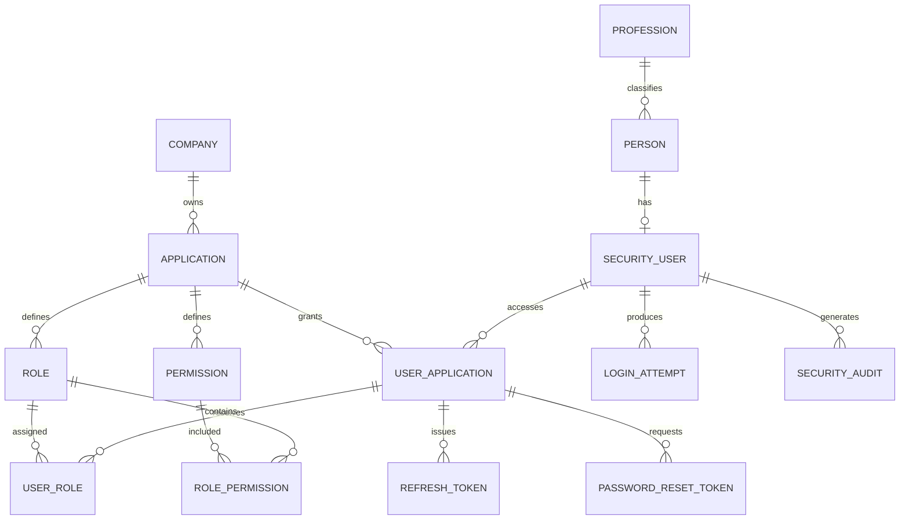

# Database model — ms-security

Project: `multiples_soluciones_para_el_agro` · Microservice: `ms-security`
Database: PostgreSQL — `security_db` · Runtime: R2DBC · Migrations: Flyway over JDBC

## 1. Model decisions

- No branches. There is no `branch` or `user_branch` table anywhere in this schema.
- `person` holds personal data; `security_user` holds credentials. A person can exist without
  credentials, but every set of credentials belongs to exactly one person (`UNIQUE (person_id)`).
- A user reaches several applications through `user_application`.
- Roles and permissions belong to an application, never to a company or to the platform.
- A role assigned to a user must belong to the same application as the access grant. This is
  enforced by composite foreign keys, not only by service code — see §6.
- Sensitive tokens are stored as hashes. Never in plain text.
- Normal operations use R2DBC; Flyway uses JDBC only for migrations.
- Every date column is `TIMESTAMPTZ`.
- Primary keys are `BIGINT GENERATED BY DEFAULT AS IDENTITY`; foreign keys are `BIGINT` (`Long` in
  Java). The model uses no UUIDs.

## 2. Entity relationships



## 3. Master tables

### company — `V1`

| Column | Type | Rule |
|---|---|---|
| id | BIGINT | PK, IDENTITY |
| code | VARCHAR(50) | NOT NULL, UNIQUE |
| name | VARCHAR(150) | NOT NULL |
| description | VARCHAR(500) | NULL |
| active | BOOLEAN | NOT NULL, DEFAULT TRUE |
| created_at | TIMESTAMPTZ | NOT NULL, DEFAULT now() |
| created_by | BIGINT | NULL |
| updated_at | TIMESTAMPTZ | NULL |
| updated_by | BIGINT | NULL |

### application — `V2`

Same audit columns, plus `company_id BIGINT NOT NULL → company.id`, `code VARCHAR(50) NOT NULL`,
`name VARCHAR(150) NOT NULL`, `description VARCHAR(500)`.

Constraint: `UNIQUE (company_id, code)`.

### profession — `V3`

`code VARCHAR(50) UNIQUE`, `name VARCHAR(150) NOT NULL`, `description VARCHAR(500)`, plus the
standard `active` and audit columns.

## 4. Identity and credentials

### person — `V4`

| Column | Type | Rule |
|---|---|---|
| id | BIGINT | PK, IDENTITY |
| profession_id | BIGINT | FK → profession.id, NULL |
| identification_type | VARCHAR(30) | NOT NULL |
| identification_number | VARCHAR(50) | NOT NULL |
| first_name | VARCHAR(100) | NOT NULL |
| middle_name | VARCHAR(100) | NULL |
| last_name | VARCHAR(100) | NOT NULL |
| second_last_name | VARCHAR(100) | NULL |
| email | VARCHAR(254) | NOT NULL |
| phone / mobile | VARCHAR(30) | NULL |
| birth_date | DATE | NULL |
| active | BOOLEAN | NOT NULL, DEFAULT TRUE |
| *audit columns* | | |

Constraints:

- `UNIQUE (identification_type, identification_number)`
- `CREATE UNIQUE INDEX uq_person_email_lower ON person (LOWER(email))` — an e-mail identifies one
  person, compared case-insensitively.

### security_user — `V5`

| Column | Type | Rule |
|---|---|---|
| id | BIGINT | PK, IDENTITY |
| person_id | BIGINT | FK → person.id, NOT NULL, UNIQUE |
| username | VARCHAR(100) | NOT NULL |
| password_hash | VARCHAR(255) | NOT NULL |
| enabled | BOOLEAN | NOT NULL, DEFAULT TRUE |
| locked | BOOLEAN | NOT NULL, DEFAULT FALSE |
| locked_until | TIMESTAMPTZ | NULL |
| failed_attempts | SMALLINT | NOT NULL, DEFAULT 0, CHECK ≥ 0 |
| last_login_at | TIMESTAMPTZ | NULL |
| password_changed_at | TIMESTAMPTZ | NULL |
| credentials_expired | BOOLEAN | NOT NULL, DEFAULT FALSE |
| account_expires_at | TIMESTAMPTZ | NULL |
| must_change_password | BOOLEAN | NOT NULL, DEFAULT TRUE |
| security_stamp | BIGINT | NOT NULL, DEFAULT 0 |
| *audit columns* | | |

Constraints:

- `CREATE UNIQUE INDEX uq_security_user_username_lower ON security_user (LOWER(username))`
- `security_stamp` is a version counter, incremented on password, role and state changes, so
  sessions issued before the change can be recognised as stale.

### Standard for `password_hash`

- Primary algorithm: **Argon2id**.
- Minimum parameters: 19 MiB memory, 2 iterations, parallelism 1.
- A random 16-byte salt per password.
- The full Argon2id encoded string is stored in `VARCHAR(255)`, prefixed with `{argon2}` by the
  `DelegatingPasswordEncoder`. A real stored value looks like:
  `{argon2}$argon2id$v=19$m=19456,t=2,p=1$<salt>$<hash>`.
- The raw password is never stored, encrypted or logged.
- Spring Security's `DelegatingPasswordEncoder` makes a future algorithm change possible without a
  flag day: the prefix records which algorithm produced each hash.
- BCrypt (cost 12) is retained **for verification of legacy hashes only**. It never produces one,
  and any non-Argon2 hash is re-hashed on the next successful login.

## 5. Multi-application access

### user_application — `V6`

| Column | Type | Rule |
|---|---|---|
| id | BIGINT | PK, IDENTITY |
| security_user_id | BIGINT | FK → security_user.id, NOT NULL |
| application_id | BIGINT | FK → application.id, NOT NULL |
| active | BOOLEAN | NOT NULL, DEFAULT TRUE |
| access_start_at | TIMESTAMPTZ | NULL |
| access_end_at | TIMESTAMPTZ | NULL |
| *audit columns* | | |

Constraints:

- `UNIQUE (security_user_id, application_id)`
- `CHECK (access_end_at IS NULL OR access_start_at IS NULL OR access_end_at > access_start_at)`
- `UNIQUE (id, application_id)` — the composite key `user_role` points at.

## 6. RBAC authorization

### role — `V7`

`id`, `application_id` (FK), `code VARCHAR(80)`, `name VARCHAR(150)`, `description VARCHAR(500)`,
`active`, audit columns.

- `UNIQUE (application_id, code)`
- `UNIQUE (id, application_id)`

### permission — `V8`

`id`, `application_id` (FK), `code VARCHAR(120)`, `name VARCHAR(150)`, `description VARCHAR(500)`,
`resource VARCHAR(100)`, `action VARCHAR(50)`, `active`, audit columns.

- `UNIQUE (application_id, code)`
- `UNIQUE (application_id, resource, action)`
- `UNIQUE (id, application_id)`

### user_role — `V9`

| Column | Type | Rule |
|---|---|---|
| id | BIGINT | PK, IDENTITY |
| user_application_id | BIGINT | NOT NULL |
| role_id | BIGINT | NOT NULL |
| application_id | BIGINT | NOT NULL |
| active | BOOLEAN | NOT NULL, DEFAULT TRUE |
| valid_from / valid_until | TIMESTAMPTZ | NULL |
| created_at | TIMESTAMPTZ | NOT NULL |
| created_by | BIGINT | NULL |

Constraints:

- `FK (user_application_id, application_id) → user_application (id, application_id)`
- `FK (role_id, application_id) → role (id, application_id)`
- `UNIQUE (user_application_id, role_id)`

The composite keys make it **impossible** to assign a role from another application, whatever the
service layer does. Verified directly against the database:

```sql
-- grant 2 is for application 1; role 3 belongs to application 2
INSERT INTO user_role (user_application_id, role_id, application_id) VALUES (2, 3, 2);
-- ERROR: violates foreign key constraint "fk_user_role_user_application"
-- DETAIL: Key (user_application_id, application_id)=(2, 2) is not present in table "user_application".
```

### role_permission — `V10`

`id`, `role_id`, `permission_id`, `application_id`, `created_at`, `created_by`.

- `FK (role_id, application_id) → role (id, application_id)`
- `FK (permission_id, application_id) → permission (id, application_id)`
- `UNIQUE (role_id, permission_id)`

Same guarantee on the other axis: a permission cannot be attached to a role from a different
application.

## 7. Tokens and security events

### refresh_token — `V11`

`id`, `user_application_id` (FK), `token_hash VARCHAR(255) UNIQUE`, `token_family VARCHAR(64)`,
`issued_at`, `expires_at`, `revoked_at`, `replaced_by_token_id` (self-FK), `device_id VARCHAR(100)`,
`device_info VARCHAR(500)`, `ip_address INET`, `user_agent VARCHAR(500)`.

- Only the SHA-256 hash is stored.
- `token_family` is a random, non-sequential id shared by every rotation of one login. It supports
  rotation and reuse detection.
- A revoked or expired token cannot be renewed. Replaying a revoked one revokes the whole family.

### login_attempt — `V12`

`id`, `security_user_id` (NULL), `application_id` (NULL), `username_attempted VARCHAR(100)`,
`success BOOLEAN`, `ip_address INET`, `user_agent VARCHAR(500)`, `failure_reason VARCHAR(80)`,
`attempted_at TIMESTAMPTZ`.

`security_user_id` is nullable because attempts against usernames that do not exist must also be
recorded — those are the interesting ones. `failure_reason` is precise in the database while the
API answers every failure with the same generic message.

### password_reset_token — `V13`

`id`, `user_application_id` (FK), `token_hash VARCHAR(255) UNIQUE`, `requested_at`, `expires_at`,
`used_at`, `invalidated_at`, `ip_address INET`, `user_agent VARCHAR(500)`.

Single-use, short-lived, stored only as a hash. Requesting a new token invalidates any outstanding
one for the same grant.

### security_audit — `V14`

`id`, `security_user_id` (NULL), `application_id` (NULL), `event_type VARCHAR(80)`,
`resource VARCHAR(100)`, `resource_id VARCHAR(100)`, `action VARCHAR(80)`, `success BOOLEAN`,
`description VARCHAR(1000)`, `metadata JSONB`, `ip_address INET`, `user_agent VARCHAR(500)`,
`correlation_id VARCHAR(64)`, `created_at TIMESTAMPTZ`.

Append-only: the API never updates or deletes a row here. `metadata` is queryable JSON:

```sql
SELECT id, event_type, metadata->>'roleCode' FROM security_audit WHERE metadata IS NOT NULL;
```

## 8. Indexes — `V15`

`application(company_id, active)` · `person(LOWER(email))` · `person(profession_id)` ·
`security_user(LOWER(username))` unique · `user_application(security_user_id, active)` ·
`user_application(application_id, active)` · `role(application_id, active)` ·
`permission(application_id, active)` · `user_role(user_application_id, active)` ·
`user_role(role_id)` · `role_permission(permission_id)` ·
`refresh_token(user_application_id, expires_at)` · `refresh_token(token_family)` ·
`login_attempt(username_attempted, attempted_at DESC)` · `login_attempt(ip_address, attempted_at DESC)` ·
`password_reset_token(user_application_id, expires_at)` ·
`security_audit(security_user_id, created_at DESC)` · `security_audit(application_id, created_at DESC)` ·
`security_audit(correlation_id)`.

Unique constraints already create their own index and are not duplicated.

## 9. `updated_at` triggers — `V16`

PostgreSQL has no `ON UPDATE CURRENT_TIMESTAMP`, so a `BEFORE UPDATE` trigger calling
`set_updated_at()` keeps `updated_at` honest on the eight tables that carry it. The insert-only and
append-only tables — `user_role`, `role_permission`, `refresh_token`, `login_attempt`,
`password_reset_token`, `security_audit` — have no `updated_at` and no trigger.

## 10. Seed data — `V17`

One company (`MSAGRO`), two applications (`AGRO_CORE`, `AGRO_FIELD`), six professions, the `ADMIN`
and `USER` roles of `AGRO_CORE`, sixteen permissions, and their role wiring. Ids are resolved with
sub-selects so the identity sequences stay correct.

The first administrator is **not** seeded here: a credential row needs a real Argon2id hash, which
only the running encoder can produce. `BootstrapAdminRunner` creates it on the first start when
`security.bootstrap.enabled` is on, and is a no-op once the username exists.

## 11. Final table list

1. `company` 2. `application` 3. `profession` 4. `person` 5. `security_user`
6. `user_application` 7. `role` 8. `permission` 9. `user_role` 10. `role_permission`
11. `refresh_token` 12. `login_attempt` 13. `password_reset_token` 14. `security_audit`

This model contains no branch table and no branch relationship.

## 12. Type mapping

| PostgreSQL | R2DBC entity | Domain model |
|---|---|---|
| `BIGINT` | `Long` | `Long` |
| `SMALLINT` | `Short` | `Integer` |
| `TIMESTAMPTZ` | `OffsetDateTime` | `Instant` (UTC) |
| `DATE` | `LocalDate` | `LocalDate` |
| `BOOLEAN` | `Boolean` | `Boolean` |
| `INET` | — | `String` |
| `JSONB` | — | `String` (raw JSON) |

`INET` and `JSONB` have no portable R2DBC Java type, so rather than leak a driver-specific class
into the model, the four tables that use them (`refresh_token`, `login_attempt`,
`password_reset_token`, `security_audit`) are handled by `DatabaseClient` adapters with explicit
SQL: `CAST(:ip AS inet)` and `CAST(:metadata AS jsonb)` on the way in, `host(ip_address)` and
`metadata::text` on the way out. The columns keep their real types — and with them the validation
and the index behaviour that made those types worth choosing.
